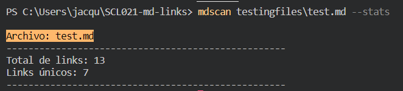

# MDScan

## Índice

* [1. Descripción](#1-descripción)
* [2. Diagrama de Flujo](#2-diagrama-de-flujo)
* [3. Instalación](#3-instalación)
* [4. Ejemplos de uso](#4-ejemplos-de-uso)

***

## 1. Descripción

MDScan es una librería creada en NodeJs con la función de leer un archivo markdown, o los archivos markdown encontrados en un directorio, extraer los links de estos y validar el estatus de cada uno. Como resultado nos puede entregar distintas estadísticas o información según el comando utilizado.

## 2. Diagrama de Flujo

Este es el diagrama de flujo utilizado para guiar y desarrollar la lógica del proyecto:

## 3. Instalación

TODO

## 4. Ejemplos de uso

Una vez instalada la librería, puedes ejecutarla con el comando 'mdscan' en tu terminal, agregando también la ruta al archivo o directorio que desees analizar (acepta tanto rutas relativas como absolutas), de la siguiente forma:

Puedes especificar también qué información quieres obtener de los archivos, '--stats' te entrega datos generales de la cantidad de links en el archivo analizado (esta es la opción por default si no se ingresa nada después de la ruta):

Mientras que la opción '--validate' nos entrega información más detallada de cada link encontrado:

También es posible combinar ambas opciones para obtener un listado resumido de toda la información obtenida ('--stats --validate' o '--validate --stats'):

En los ejemplos anteriores se le ha entregado solo un archivo para analizar, pero funciona de igual manera si se le entrega la ruta a un directorio:

